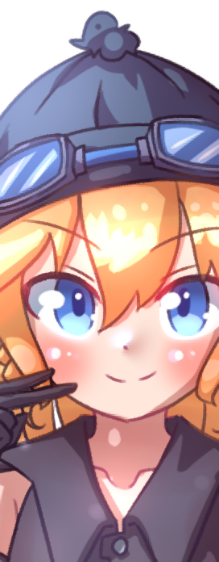
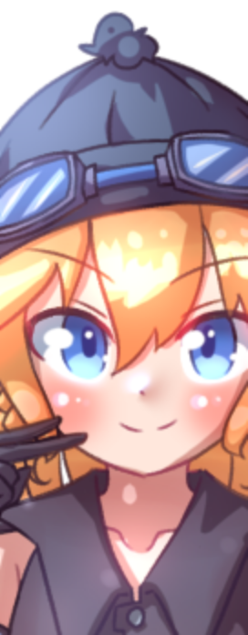
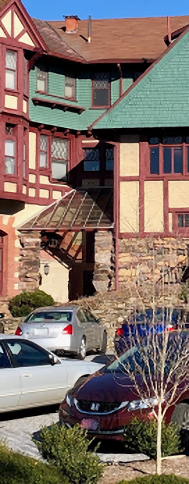
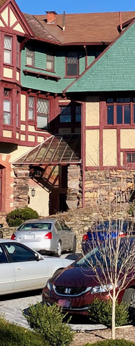

# Nene2X

Super small 2x upscaling neural network.

General architecture: simple ReLU/LReLU convolutional neural network that upscales an image by 2x. Works as a cleanup pass for a simple upscaler: the network gives you 4 values per input pixel, you use them to push around the 4 pixels produced by the simple upscaler. The simple upscaler may be bilinear, EDI, jinc, blurred bilinear, etc. as specified by the model's configuration.

By default, this is a **single-channel upscaler**. For RGB, my recommendation is to upscale the image in YCgCo instead of RGB. A multichannel mode is supported during model training/creation, but is slower to converge and results in bigger, slower models for the same quality on most inputs; they only help in extreme cases.

If you really really really need to ensure that the output doesn't have added color fringing, you should add a traditional DSP chroma correlation pass that extracts the luma-driven parts of the chroma channels before upscaling and then adds them back in after the fact. This is work for you to do on your own, not done here.

The model architecture is designed to be extremely easy to integrate into any existing project that has a post-processing framework capable of handling *any* upscaler. The smallest models runs once per input pixel and produces a set of residuals instead of a single residual.

## I just want to upscale an image

`uv run python infer.py --yonly myupscaler.safetensors myimage.png`

Or `--ycgco` to upscale chroma too, or omit the parameter to upscale per RGB channel. `--yonly` is the least prone to color smearing artifacts.

This project uses uv for dependency management; install it first. Don't worry, it's not like conda, it won't bite.

## Examples

PSNR / SSIM: higher is better. LPIPS: lower is better. Done in ycgco mode with the corresponding model and wrapping not enabled.

Results are generally comparable to "Convolutional upscaling Neural Network, yeah!" but slightly noisier because more of the training data is photos.

### alice

| Original | pico (260 params) | mini (1,536 params) |
| --- | --- | --- |
| <br>PSNR ----- / SSIM ------ / LPIPS ------ | <br>PSNR 36.70 / SSIM 0.9875 / LPIPS 0.0108 | <br>PSNR 37.94 / SSIM 0.9904 / LPIPS 0.0111 |

| medium (9,193 params) | silly (95,549 params) | photo sillyish3 (120,165 params) |
| --- | --- | --- |
| <br>PSNR 38.89 / SSIM 0.9919 / LPIPS 0.0087 | <br>PSNR 39.33 / SSIM 0.9927 / LPIPS 0.0092 | <br>PSNR 37.25 / SSIM 0.9868 / LPIPS 0.0113 |

| nn | bilinear | fsr 1.x |
| --- | --- | --- |
| <br>PSNR 30.54 / SSIM 0.9532 / LPIPS 0.1136 | <br>PSNR 32.73 / SSIM 0.9679 / LPIPS 0.0656 | <br>PSNR 36.56 / SSIM 0.9875 / LPIPS 0.0216 |

### photo

Note: some of the stairstepping artifacts are caused by the 2x downscale being done with a box filter instead of sinc or jinc. Not all of them, though.

| Original | pico (260 params) | mini (1,536 params) |
| --- | --- | --- |
| <br>PSNR ----- / SSIM ------ / LPIPS ------ | <br>PSNR 22.64 / SSIM 0.8041 / LPIPS 0.1607 | <br>PSNR 22.86 / SSIM 0.8105 / LPIPS 0.1762 |

| medium (9,193 params) | silly (95,549 params) | photo sillyish3 (120,165 params) |
| --- | --- | --- |
| <br>PSNR 23.09 / SSIM 0.8223 / LPIPS 0.1602 | <br>PSNR 22.74 / SSIM 0.8132 / LPIPS 0.1276 | <br>PSNR 21.94 / SSIM 0.7781 / LPIPS 0.0887 |

| nn | bilinear | fsr 1.x |
| --- | --- | --- |
| <br>PSNR 21.50 / SSIM 0.7609 / LPIPS 0.1453 | <br>PSNR 21.39 / SSIM 0.7076 / LPIPS 0.3332 | <br>PSNR 22.29 / SSIM 0.7769 / LPIPS 0.2163 |

## Pretrained models

The `pretrained/` directory has models that were trained on both illustrations and photos. The `pretrained_photo/` directory has models that were trained mainly on photos with a couple runs on illustrations just for stability.

The models are named `nene2x_NAME_DESC`, where DESC has the following syntax (not exhaustively described):

- `b,` -- bilinear base layer
- `g,` -- blurred bilinear base layer
- `,` -- new layer
- `1x1`, `3x3`, etc. -- receptive field of this layer
- `_12`, `_16`, etc -- number of outputs/channels per pixel going away from this layer
- `_d` -- depthwise convolution

Each non-`1x1` layer requires its own pass, if implemented as a shader. So `nene2x_nano_3x3_4,3x3_9,1x1_9,1x1_4.safetensors` is a 2-pass shader, `nene2x_pico_b,3x3_12,1x1_8,1x1_4.safetensors` is a 1-pass shader, etc.

For the full syntax see the source code.

The bigger the numbers or longer the model description is, the more expensive it is. Generally only the smallest models are suitable for realtime upscaling and the biggest ones are only suitable for offline upscaling.

## Integration notes

**If your postprocessing framework can handle them, you should use a multipass model** (assuming you aren't going for absolute minimum cost with the `nene2x_pico_b,3x3_12,1x1_8,1x1_4.safetensors` model).

For post-processing systems that don't support temporary non-displayed render targets, 1pass models can be made to work by running them once for each output pixel, instead of once for each input pixel. This will make them 4x as expensive, but they'll at least work. Doing this for multipass models would be impractical.

## Use as a shader

Run `glsl.py` on one of the networks in `pretrained/` to get a set of GLSL functions that can be ducktaped into any multipass-capable post-processing system to sharpen up a basic (e.g. bilinear) upscale. Some models are incompatible with some post-processing systems; if you only have one texture output per pass, for example, you can't use models where any non-1x1 layer has more than 4 inputs per pixel (for example, `3x3_8,1x1_4,3x3_4` is in single-output-texture systems, but not `3x3_8,1x1_8,3x3_4`). See `examples/nn2x.omwfx` as an example of how the ducktaping works. (Note that `omwfx` files don't, at the time of writing, support producing a higher resolution than they take in, so the middle 50% of the input is taken and upscaled, so it's purely for demonstration.)

See `magpie_gen.py` and `magpie_out/` for magpie stuff.

`glsl.py` is probably slightly outdated and likely to choke on some model topologies, also likely to be stupid slow for no reason. Feel free to update it.

## Training

Modify `model.py` directly to set the network architecture before training. There's a `gConfig` variable with old configs listed. Training data is in `train_authentic/`. Small networks train in 5~25 minutes on an RX 6800 depending on network size.

`uv run python train.py train_authentic/`

## Training Tips

**NOTE IMPORTANTLY:** Some very small network topologies are extremely prone to breaking (getting trapped in bad local minima) on unlucky initializations, such that they fail to stop producing some artifacts during training. For such networks, use `train_until_good.py` to get them started, then resume them with the main training script and `--resume`. Training is done with Leaky ReLUs instead of pure ReLUs to make this problem less common, but it can still happen for extremely small network configurations.

You may need to change the LReLU slope to have a stable training startup for some network topologies and then reduce it gradually over multiple resumptions. This is a known shortcoming of ultra-small LReLU models and there's not much I can do about it.

If gridlines or checkerboards appear on certain colors of flat surface after training, don't throw the model away. Instead, `--resume` a copy of it with a very low learning rate like `--lr 0.0001` for a few epochs. If the artifacts still appear, try again. If they still appear, try a higher or lower learning rate, or a different loss function.

For extremely large networks, it's beneficial to switch back and forth (resuming training) between the mixed "authentic" training data set, and either the photo or illustration data set, depending on whether you're making an illust or photo upscaler. If you're making a generic upscaler, you should switch back and forth between all three.

If you're using `--adv-filter2-loss`, it's basically a microscopic GAN, but because it's so small, it's prone to learning to emit speckles and hard edge lines. Fine tuning at the very end of training with fancy loss for 5 epochs and a los learning rate can reduce them, but make a bcakup first: `--fancy-loss --epochs 5 --lr 0.00004`

Depending on the dataset and intended distribution of upscaled images, the best loss functions tend to be the default (L1 loss), `--adv-filter-loss`, and `--fancy-loss`. The default is better for clean datasets with less high-frequency detail and the filter/fancy losses are better for photographs. `--le-loss` works but is slow and almost indistinguishable from the default L1 loss. adv-filter2-loss is good for short runs but tends to degenerate and start generating artifacts on long runs, especially on medium/large-sized models.

```
    --fancy-loss         - Loss uses high-freq feature vectors to punish blurry output.
    --le-loss            - Vibecoded implementation of arXiv:2201.10084. Blurry.
    --adv-filter-loss    - A micro-GAN-like thing inspired by fancy loss. GAN learns
                            feature vectors only, loss is feature vector difference.
                            In effect, the micro-GAN learns what features the upscaler
                            is failing to produce the right amounts of, rather than
                            telling the upscaler whether its output looks real or not.
    --adv-filter2-loss   - A straight up micro-GAN that operates on raw output like a
                            normal GAN does, but so small that it can't hallucinate.
                            Aside from the size, this is a normal GAN in that it tells
                            the upscaler whether its output looks real or not.
```

`--adv-filter-loss` can be tuned with `--adv-loss-weight X`; the default weight is 0.3. The default weight of 0.3 is very aggressive and leads noisy oversharpening and strong edge-chckerboards on clean illustrations for most model sizes, especially very small ones, and even some photos with particularly clean feature boundaries (e.g. dark building vs bright sky). This tuning is best for photo-based texture images (e.g. as used in games) but for other data distributions you want a smaller weight.

## LLM Usage & Copyright

The architecture of the networks being trained was decided by myself and not the LLM. This readme was written entirely by myself.

The code in this repository is heavily full of LLM boilerplate and has many functions that are entirely LLM-generated. (Unfortunately, this is currently the standard for AI/Machine Learning research.)

All of the training data under the `train` folders is either public domain (CC0 images from Flickr) or authored by myself.

## List of stuff

- `train.py` -- for orchestrating training/resumption
- `model.py` -- core of the whole thing
- `infer.py` -- command line image upscaler and a couple of related tools
- `comparer.py` -- objective baseline-driven image quality metric reporter
- `glsl.py` -- (incomplete) glsl function generator for simple models. might generate badly-structured glsl code (e.g. it's possible that it matmuls in the wrong order or orientation for cache coherency or something), i'm not an expert and don't know if there's any specific structure i need to prompt for.
- `train_until_good.py` -- for the initial training run of ultra-small networks that are prone to getting stuck or being unstable
- `todds.py` -- dds texture compression frontend, for people using infer.py to bulk upscale video game textures
- `ddslop.py` -- the dds library used by todds because PIL/pillow doesn't support saving dds mipmaps (????? why)
- `merge.py` -- image frequency band merging script. useful for making the outputs of upscalers with bad baseline information content retention (like ESRGAN) have numbers that are as good as they should be when dumped into comparer.py. without this, upscalers with bad baseline information content retention (like ESRGAN) have worse objective metrics than they should. (if you don't do this on your competitors and use the best possible results, you're probably benchmark hacking!)
- `make_comparison_table.py` -- used to update the readme
- `train_*/` -- training data. you probably only want train_authentic and train_photo. the other folders are for trial and evaluation runs. use your intuition.
- `test/` -- raw test images for you to use while adjusting model topology or loss functions.
- `test_w2x/` -- cherrypicked waifu2x upscales that make waifu2x look as good as possible. can be used as a sanity check on model output quality. remember that waifu2x is a super big model. the variant used for this was the swin-unet photo model, no denoising, 2x, etc.
- `pretrained_*/` -- pretrained upscaling networks. the general/illustration models were trained with L1 loss (possibly with a couple passes of fancy loss), the photo models were trained with whatever advanced loss functions gave the best lpips and then cleaned up with a small number of weak L1 runs.
- `fsr/` -- vibecoded fsr 1.x implementation feeding an offline 2x upscaler. matches or slightly outdoes amd's official fsr 1.1 CLI tool. worse than fsr 2.x obviously. fsr 1.x had a very complicated development history so there's no one "canonical version" to compare against; i just made sure it was doing the right things and had good objective metrics on the output.
- `example_outputs/` -- example images for the readme
- `examples/` -- other examples

## License

All code and model data in this repo is licensed under your choice of:

- Creative Commons Zero, any version
- BSD-0
- Unlicense

The training images are provided for training and may be freely redistributed for that purpose, including heavily transformed versions of them. Any model data produced by training on them belongs to you. The photos in particular are CC0.
